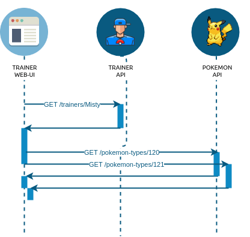
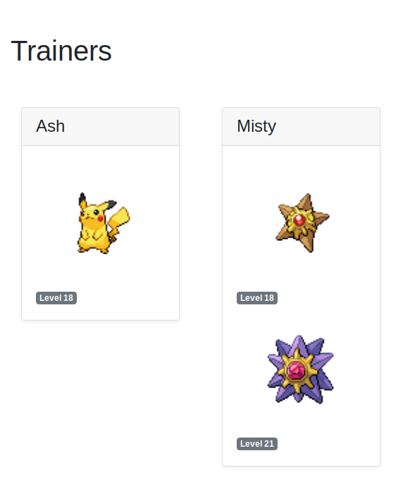

:source-highlighter: pygments
:prewrap!:

:icons: font

:iconfont-cdn: https://use.fontawesome.com/releases/v5.4.2/css/all.css

:toc: left
:toclevels: 4

:linkattrs:

:sectlinks:
:sectanchors:
:sectnums:

:experimental:

:stem:

= ALTEA - TP 7 - Asynchronism & High-Availability

== Présentation et objectifs

Le but est de continuer le développement de notre architecture "à la microservice".

Nous allons aujourd'hui rendre les appels entre le pokemon-ui et les autres micro-services asynchrone.

Nous allons également ajouter du cache, ainsi qu'un circuit-breaker pour améliorer les performances de nos services !

[TIP]
Pendant ce TP, nous faisons évoluer notre IHM pokmeon-ui ! Nous allons également commencer les développements du
micro-service de combat !

[WARNING]
Ce TP est moins guidé que d'habitude. Nous avons déjà toutes les bases nécessaires pour travailler de manière autonome.

== pokemon-ui

=== Page des trainers

Ajoutez dans votre IHM l'affichage de la liste des dresseurs de Pokemons, ainsi que leur équipe.

Cette liste pourra prendre la forme suivante :

=== Résilience (cache, circuit-breaker, retry)

Ajoutez une gestion de cache sur le service qui récupère la liste des types de pokemon ainsi que la liste des dresseurs.

Le cache des dresseurs doit avoir une durée de vie assez courte (1 minute), parce qu'un dresseur peut faire évoluer son équipe !

Ajoutez également un circuit-breaker ou un retry sur ces services.

Testez unitairement le bon fonctionnement de votre cache.

Voici pour vous aider un test unitaire que j'ai implémenté pour valider la bonne configuration de mon cache :

[source,java,linenums]
.PokemonTypeServiceImplTest.java
----
package com.miage.altea.tp.pokemon_ui.config;

import com.miage.altea.tp.pokemon_ui.pokemonTypes.bo.PokemonType;
import com.miage.altea.tp.pokemon_ui.pokemonTypes.service.PokemonTypeService;
import com.miage.altea.tp.pokemon_ui.pokemonTypes.service.PokemonTypeServiceImpl;
import org.junit.jupiter.api.BeforeEach;
import org.junit.jupiter.api.Test;
import org.mockito.Mock;
import org.mockito.MockitoAnnotations;
import org.springframework.beans.factory.annotation.Autowired;
import org.springframework.beans.factory.annotation.Value;
import org.springframework.boot.test.context.SpringBootTest;
import org.springframework.cache.CacheManager;
import org.springframework.web.client.RestTemplate;

import static org.junit.jupiter.api.Assertions.*;
import static org.mockito.Mockito.*;

@SpringBootTest //<1>
class PokemonTypeServiceImplTest {

    @Autowired
    PokemonTypeServiceImpl pokemonTypeService;

    @Mock
    RestTemplate restTemplate;

    @Value("${pokemonType.service.url}/pokemon-types/{id}")
    String expectedUrl;

    @Autowired
    CacheManager cacheManager;

    @BeforeEach
    void setUp() {
        MockitoAnnotations.initMocks(this);
        pokemonTypeService.setRestTemplate(restTemplate); //<2>

        var pikachu = new PokemonType();
        pikachu.setId(25);
        pikachu.setName("Pikachu");
        when(restTemplate.getForObject(expectedUrl, PokemonType.class, 25)).thenReturn(pikachu);
    }

    @Test
    void getPokemonType_shouldUseCache() {
        pokemonTypeService.getPokemonType(25);

        // rest template should have been called once
        verify(restTemplate).getForObject(expectedUrl, PokemonType.class, 25);

        pokemonTypeService.getPokemonType(25);

        // rest template should not be called anymore because result is in cache ! <3>
        verifyNoMoreInteractions(restTemplate);

        // one result should be in cache !
        var cachedValue = cacheManager.getCache("pokemon-types").get(25).get();
        assertNotNull(cachedValue);
        assertEquals(PokemonType.class, cachedValue.getClass());
        assertEquals("Pikachu", ((PokemonType)cachedValue).getName());
    }
}
----
<1> Nous exécutons un test d'intégration qui démarre spring-boot
<2> Dans le test, nous remplaçons le `RestTemplate` de spring par un mock, qui nous permettra de vérifier s'il a été appelé
<3> Nous validons que le cache est bien utilisé

=== Validation de vos développements

Pour vous amuser, vous pouvez tester vos développements avec une ou plusieurs de vos API éteintes pour voir ce qu'il se passe.

Vous pouvez également "catcher" la `CircuitBreakerOpenException`, et définir dans le `catch`, un scénario alternatif
pour éviter que votre application ne plante (renvoyer une liste de Pokemons vide est un bon début :) ).

Vous pouvez également essayer d'appeler une autre API si la votre est indisponible (celle de votre voisin par exemple?).

== battle-api

Nous commençons dans ce TP le développement du service de combats, que nous continuerons sur les prochaines semaines !

=== Projet Github

Cliquez sur le lien suivant pour initialiser votre projet sur Github : https://classroom.github.com/a/0zcdPtV-[Github classroom,window="_blank"]

=== Stats des Pokemons

Les types de Pokemon ont des statistiques de base :

* vitesse
* attaque
* défense
* hp

Chaque Pokemon, en fonction de son niveau, aura des statistique qui s'appuient sur ces statistiques de base.
Pour les statistiques de vitesse, d'attaque et de défense, la statistique du pokemon est:

asciimath:[stat=5+(baseStat * (niveau)  / 50)]

Les points de vie du Pokemon sont calculés avec cette formule :

asciimath:[stat=10+niveau+(baseStat * (niveau)  / 50)]

NOTE: Un pokemon de niveau 50 a les stats de base + 5, et un nombre de points de vie égal aux stats de base + 60.
Un pokemon de niveau 100 a les stats de base * 2 + 5, et un nombre de points de vie égale à la stat de base * 2 + 110

Pour donner un exemple concret :

Pikachu a les stats de base suivantes :

.Les stats de base de Pikachu
|===
| attack  | 55
| defense | 40
| speed   | 90
| hp      | 35
|===

Un pikachu de niveau 5 a les stats suivantes :

.Quelques niveaux de pikachu
[options="header"]
|===
|pikachu  |niveau 6|niveau 18|niveau 50|niveau 100
| attack  | 11     | 24      | 60      | 115
| defense | 8      | 15      | 35      | 65
| speed   | 15     | 37      | 95      | 185
| hp      | 20     | 40      | 95      | 180
|===

=== Attaque et défense

Lors d'un combat, quand un pokémon en attaque un autre, il lui inflige des dégat qui sont retirés des points de vie du pokemon attaqué.

La formule pour calculer les dégats infligés par une attaque est :

.La formule des dégats, avec n le niveau du pokemon attaquant, a sa statistique d'attaque, et d la statisque de défense du pokemon adverse.
asciimath:[( ( (2*n)/5 + 2 * a / d ) + 2 )]

=== Règles du combat

Le combat se déroule en tour par tour.

Lors d'un tour, chaque dresseur de pokemon peut donner un ordre à son pokemon (attaquer), ou utiliser un objet (potion, etc...).

C'est le dresseur dont la stat de vitesse du pokemon est la plus élevée qui commence. Suivi de l'autre dresseur.

Si pendant un tour la vie de l'un des deux pokemons tombe à 0, il est KO. C'est le pokemon suivant du dresseur qui prend la suite, et un nouveau tour commence.

=== Utilisation de l'API

Dans un premier temps, notre API de combat devra exposer les routes suivantes :

* POST /battles : Prend 2 paramètres (noms des 2 dresseurs en paramètres). Crée une instance de combat, et retourne un `UUID` permettant de l'identifier.
* GET /battles : liste les combats en cours
* GET /battles/{uuid} : Récupère l'état d'un combat en cours
* POST /battles/{uuid}/{trainerName}/attack : Permet à un dresseur de donner un ordre d'attaque pendant le combat. Retourne l'état du combat.
  1. Si le trainer attaque quand ce n'est pas son tour, renvoie une erreur 400 BAD REQUEST

Le combat prend la forme suivante :

.Le combat au format JSON
[source,javascript,linenums]
----
{
    "uuid": "387545db-2219-44cd-9b7a-f84e1e2c7fb5",
    "trainer": {
        "name": "Ash",
        "team": [
            {
                "pokemonType": 25,
                "level": 18,
                "maxHp": 40,
                "attack": 24,
                "defense": 19,
                "speed": 37,
                "hp": 40
            }
        ]
    },
    "opponent": {
        "name": "Misty",
        "team": [
            {
                "pokemonType": 120,
                "level": 18,
                "maxHp": 38,
                "attack": 21,
                "defense": 24,
                "speed": 35,
                "hp": 38
            },
            {
                "pokemonType": 121,
                "level": 21,
                "maxHp": 56,
                "attack": 36,
                "defense": 40,
                "speed": 53,
                "hp": 56
            }
        ]
    }
}
----

Le calcul des dégat se fait bien côté serveur.

L'API battle doit donc :

* appeler l'API trainers pour récupérer les équipes des deux dresseurs lorsqu'un nouveau combat est créé
* stocker le combat (en mémoire pour commencer)
* appeler l'API PokemonTypes pour récupérer les statistiques de base des types de Pokemon et calculer les valeurs des statisques des Pokemons en fonction de leur niveau
* Lors d'un appel à `/attack`, effectuer une attaque entre les deux pokemons, en calculant les dégâts, et retourner le résultat

